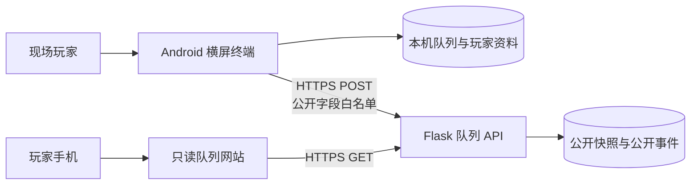

# maimai Q

[](https://github.com/tsuba-abcccc/maimai-queue-terminal/tags)
[](https://developer.android.com/about/versions/10)
[](https://kotlinlang.org/)
[](https://developer.android.com/compose)

面向机厅现场的双机台电子排队终端。maimai Q 用电子队列模拟现场“挪东西排卡”的流程，在保留玩家游玩偏好和现场调整能力的同时，提供等待时间估算、本机持久化、操作日志和可选的网站同步。

项目以 Android 横屏终端为现场唯一操作端。网络不可用时，排队仍然完整运行在本机；开启同步后，公开队列会上传到只读网站供玩家查看。

> 当前版本仍处于 `0.x` 阶段。用于真实现场前，请先根据本机厅规则完成测试，并安排能够处理误操作和机台故障的现场人员。

## 快速链接

- [在线查看当前队列](https://abcccc.top/queue-status)
- [玩家使用手册](docs/user-manual.md)
- [玩家使用手册 PDF](output/pdf/maimai-Q-玩家使用手册.pdf)
- [0.1.0 至 0.2.13 更新日志](docs/update.md)
- [云端同步协议](docs/cloud-queue-sync.md)
- [后端部署说明](cloud-server/README.md)

## 项目定位

maimai Q 处理的是机厅现场排队，不是线上预约系统。它将两台机台视为彼此独立的队列，并把每名玩家的登记、游玩偏好和现场状态组合成一轮轮可执行的等待位置。

| 概念 | 含义 |
| --- | --- |
| 登记 | 一名玩家的一次排队记录 |
| 等待位置 | 按顺序和游玩偏好组成的一轮候场玩家 |
| 游玩位置 | 当前应当正在对应机台游玩的玩家 |
| 允许他人加入 | 接受系统与另一名开放玩家自动组成共同游玩 |
| 固定组合 | 两份登记固定一起上机，不参与自动重新配对 |

单人游玩按约 12 分钟、共同游玩按约 15 分钟估算。当前一轮已经经过的时间会从后续等待时间中扣除。

## 当前功能

### 排队和现场推进

- 机台 A、机台 B 两条完全独立的登记顺序。
- 游玩位置、等待位置、登记人数和总人数统计。
- 单人游玩、允许他人加入和与朋友固定组合。
- 结束本轮并自动开始下一轮，或仅结束当前轮次。
- 将误进入游玩位置的玩家撤回等待顺序前端。
- 将实际已经共同上机的等待玩家补入当前游玩位置。
- 游玩超过 20 分钟时提醒，并支持补记现场已完成但忘记操作的轮次。
- 少数影响整条队列的重要操作提供约 5 秒撤销入口。

### 暂缓、暂离和未到场

- “暂缓一轮”只跳过下一次上机机会，登记不移动，触发后自动解除。
- “暂时离开”会被排队计算忽略；每次轮到时移至队尾，需要玩家回来后手动取消。
- 暂离连续轮空 3 次后仍保留，第 4 次轮到时仍未返回则自动退出。
- 暂缓或暂离玩家不会被错误标记为未到场。
- 未到场仅适用于游玩位置和当前真正轮到的首个有效等待位置。
- 系统会结合单人、开放加入、固定组合和离开状态重新计算游玩组合与时间。

### 玩家资料和登记

- 临时登记、玩家资料库和预留的二维码入口。
- 玩家资料搜索、推荐排序、首字母排序和四列紧凑布局。
- 玩家昵称、性别、默认游玩偏好，以及 QQ 号或中国大陆手机号中的一种联系方式。
- 默认偏好可设为“每次询问”，也可把本次选择保存为以后默认。
- 使用玩家资料认领临时登记，保留原机台和位置，并将昵称更新为资料昵称。
- 修改本次游玩偏好时，不会意外覆盖玩家资料的默认偏好。
- 性别和联系方式只在需要的详情页面显示，不出现在公开排队表面。

### 队列编辑和纠错

- 长按登记直接进入顺序调整，游玩位置玩家保持锁定。
- 长按等待位置可连同位置框跨多个位置拖动。
- 拖动时支持边缘自动滚动、任意方向跟手和无效落点回弹。
- 最终顺序未变化时，不会误判为一次调整。
- 使其他玩家延后的调整会要求确认已取得所有受影响玩家同意。
- “更多”中保留独立的完整登记编辑页面，适合集中整理队列。

### 本机运行和管理

- 队列、玩家资料、机台规则和操作日志保存在终端本机。
- 重启应用时询问是否继续使用上次队列。
- 最多保留最近 1,000 条本机详细操作日志。
- 机台停止使用时保留全部登记；恢复后本轮计时从头开始。
- 可分别设置是否允许暂缓一轮、是否允许暂时离开。
- 支持自定义机台现场备注，固定名称“机台 A / B”保持不变。
- 重要操作使用确认弹窗、状态动画和克制的操作音效。

### 网站同步

- 现场变化先保存到本机，再异步上传公开快照。
- 网络失败不会阻止现场操作，应用会在后台自动重试。
- 首页显示已同步、同步中、待重试、已关闭或未配置等状态。
- 网站提供两台队列、位置详情、时间估算、公开日志和“标记为自己”。
- 标记后可查看自己的位置、预计时间、共同游玩对象和未到场等处理结果。
- 网站目前只读，不能远程改变现场队列。

<p align="center">
  
</p>

<p align="center"><sub>只读队列网站的移动端界面；现场操作仍以 Android 终端为准。</sub></p>

## 系统架构



边界设计：

- Android 终端是队列状态的唯一写入方。
- 本机保存优先于云端同步，服务器故障不会中断现场排队。
- 后端再次按白名单构造公开数据，不原样保存终端传来的未知字段。
- 当前网站不提供写接口，为以后动态网站和远程交互保留协议扩展空间。
- 仓库包含 Android 应用和队列 API；当前在线网站前端由独立站点项目托管。

## 运行要求

### 终端

- Android 10（API 29）或更高版本。
- 横屏设备，建议使用固定摆放并持续供电的平板或排队终端。
- 需要网站同步时，终端必须获得系统联网权限。

### 开发环境

- Android Studio，或能够构建原生 Android 项目的 DevEco Studio。
- JDK 21（推荐）。请确认 Gradle JDK 指向真实存在的 JDK，而不是已经被移除的旧 IDE Runtime。
- Android SDK 36。
- 项目自带 Gradle Wrapper `9.5.0`，不需要单独安装 Gradle。

主要技术版本：

| 组件 | 版本 |
| --- | --- |
| Android Gradle Plugin | 9.3.0 |
| Kotlin | 2.2.10 |
| Jetpack Compose BOM | 2026.02.01 |
| minSdk | 29 |
| targetSdk | 36 |

## 构建 Android 应用

```powershell
git clone https://github.com/tsuba-abcccc/maimai-queue-terminal.git
Set-Location maimai-queue-terminal
.\gradlew.bat :app:assembleDebug
```

调试 APK 生成在：

```text
app/build/outputs/apk/debug/app-debug.apk
```

macOS 或 Linux 使用：

```bash
./gradlew :app:assembleDebug
```

第一次构建需要联网下载 Android 和 Gradle 依赖。

### 纯本地模式

不配置同步令牌即可使用纯本地模式。应用仍会保存队列、玩家资料和操作日志，只是不向网站上传。

### 配置网站同步

不要把正式令牌写入仓库。推荐放在开发账户的 `~/.gradle/gradle.properties`：

```properties
QUEUE_SYNC_URL=https://your-domain.example/api/queue-status
QUEUE_SYNC_TOKEN=<与服务器一致的高强度随机令牌>
```

也可以使用同名环境变量。构建时令牌会进入 APK，因此：

- 公开分发版与现场终端版应使用不同签名和不同配置。
- 不要在公开 APK 中放入仍有生产写入权限的令牌。
- 令牌泄漏后应立即在服务端轮换。

## 部署队列 API

后端位于 [`cloud-server/`](cloud-server/)，使用 Flask、Gunicorn 和 SQLite。最简 Docker 部署：

```bash
cd cloud-server
cp .env.example .env
# 编辑 .env，至少设置 QUEUE_SYNC_TOKEN
docker compose up -d --build
```

然后将 [`nginx-location.conf.example`](cloud-server/nginx-location.conf.example) 中的精确路径加入 HTTPS 站点，并检查：

```bash
curl https://your-domain.example/queue-api-healthz
```

应返回：

```json
{"service":"maimai-queue-status","status":"ok"}
```

服务器还支持 systemd 部署、主终端优先和离线后的备用终端接管。完整步骤见[后端部署说明](cloud-server/README.md)。

## 数据和隐私

| 数据 | 本机保存 | 上传公开服务 |
| --- | --- | --- |
| 昵称、机台、队列位置 | 是 | 是 |
| 游玩偏好、暂缓、暂离、未到场 | 是 | 是 |
| 公开队列事件 | 是 | 是 |
| QQ 号或手机号 | 是 | 否 |
| 性别 | 是 | 否 |
| 玩家资料内部编号 | 是 | 否 |
| 玩家资料编辑日志 | 是 | 否 |

应用已关闭 Android 系统备份，避免玩家资料通过系统备份离开受控终端。公开网站不会显示联系方式。

## 测试

运行 Android 单元测试：

```powershell
.\gradlew.bat :app:testDebugUnitTest
```

运行后端测试：

```powershell
Set-Location cloud-server
python -m unittest -v
```

测试覆盖队列演化、暂缓和暂离、玩家联系方式、资料认领、时间估算、队列持久化、同步控制器、公开快照、操作日志和后端接口。

## 项目结构

```text
maimai-queue-terminal/
├─ app/                    Android 终端、排队模型和单元测试
├─ cloud-server/           可选的 Flask 同步 API 与部署配置
├─ docs/
│  ├─ cloud-queue-sync.md  同步协议和公开字段边界
│  ├─ update.md            累计更新日志
│  ├─ user-manual.md       玩家使用手册
│  └─ images/              README 使用的公开界面图片
├─ output/pdf/             排版后的玩家手册 PDF
└─ gradle/                 Gradle Wrapper 与版本目录
```

## 当前限制和后续方向

- 二维码入口已经预留，但当前版本尚未启用。
- 玩家资料目前保存在终端本机，尚未提供云端资料库。
- 网站目前只读，远程排队和远程修改队列尚未开放。
- 当前公开站点的前端源码不在本仓库中。
- 仓库没有包含可公开使用的生产同步令牌或正式签名密钥。

后续计划包括云端玩家资料、权限明确的动态网站交互、二维码身份入口，以及将公开安装版与现场终端版分离。

## 参与开发

提交改动前请注意：

1. 队列逻辑应模拟现场真实推进，不能只调整画面顺序。
2. 游玩位置玩家与等待玩家的状态变化必须分开处理。
3. 会延后其他玩家的操作需要明确确认和对应测试。
4. 新增公开同步字段时，必须同步检查隐私白名单和旧协议兼容。
5. 界面用语统一使用“登记”“等待位置”“游玩位置”“暂缓一轮”“暂时离开”和“未到场”。

建议先创建 Issue 说明现场场景、预期队列演化和边界情况，再提交 Pull Request。

## 许可证

当前仓库尚未附带开源许可证，默认保留全部权利。公开查看源码不等同于获得复制、修改、分发或商业使用授权。正式采用开源许可证后，本节会同步更新。

## 声明

maimai Q 是独立开发的非官方现场排队工具，与 SEGA 或 maimai 官方没有隶属、授权或背书关系。项目名称中提及的产品和商标归其各自权利人所有。
