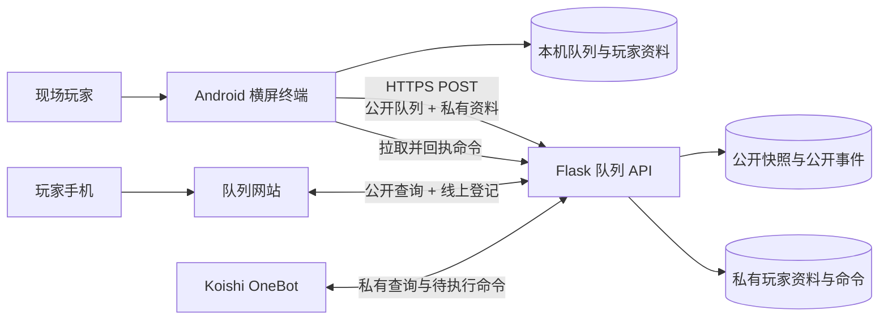

# maimai Q

[](https://github.com/tsuba-abcccc/maimai-queue-terminal/tags)
[](https://developer.android.com/about/versions/10)
[](https://kotlinlang.org/)
[](https://developer.android.com/compose)

面向机厅现场、支持 1 至 10 台机台的电子排队终端。maimai Q 用电子队列模拟现场“挪东西排卡”的流程，在保留玩家游玩偏好和现场调整能力的同时，提供等待时间估算、本机持久化、操作日志，并可选择与服务端同步。

项目以 Android 横屏终端为现场最终操作端。网络不可用时，排队仍然完整运行在本机；开启同步后，网站和 QQ Bot 可以查看队列，并通过玩家资料提交线上登记。所有远程操作仍由现场终端按本地规则校验并写入。

> 当前版本仍处于 `0.x` 阶段。用于真实现场前，请先根据本机厅规则完成测试，并安排能够处理误操作和机台故障的现场人员。

## 快速链接

- [公开测试版自建部署方案](docs/public-beta-deployment.md)
- [独立公开队列页说明](public-site/README.md)
- [玩家使用手册](docs/user-manual.md)
- [玩家使用手册 PDF](output/pdf/maimai-Q-玩家使用手册.pdf)
- [0.1.0 至 0.13.0 更新日志](docs/update.md)
- [0.13.0 管理后台发布说明](docs/releases/0.13.0-management-app.md)
- [后续版本路线](docs/roadmap.md)
- [开发与交付记录](docs/development-log.md)
- [云端同步协议](docs/cloud-queue-sync.md)
- [后端部署说明](cloud-server/README.md)

## 不自行构建的公开测试部署

如果只想使用已经验收的公开测试包，不需要构建 Android 应用、网站前端或 QQ Bot。请从[GitHub Releases](https://github.com/tsuba-abcccc/maimai-queue-terminal/releases)下载同一 Release 中的配套附件，并按[公开测试版自建部署方案](docs/public-beta-deployment.md)配置自己的服务端和 Bot：

1. 终端直接安装 `maimai-Q-<版本>-terminal-beta.apk`；不需要运行 Gradle。完全离线使用时安装 `local-beta.apk`，它不会连接服务器。
2. 服务端使用 Release 对应的源码或 Docker 构建上下文启动 API。当前公开 Release 尚未提供预构建 Docker 镜像，因此服务端仍需在自己的主机执行一次 `docker compose up -d --build`；这不会涉及 Android 或网站前端构建。
3. Bot 直接安装 Release 中配套版本的 `koishi-plugin-maimai-q-<Bot版本>.tgz`，不需要从源码打包。只使用 Bot 时可以不部署网站；需要公开队列或线上登记时，再直接解压同一 Release 的 `public-site-<终端版本>-beta.tar.gz`，由 Nginx/Caddy 提供静态文件，不需要运行 Vite 构建。
4. 使用 Release 附带的 `SHA256SUMS` 校验所有下载文件，服务端地址、令牌、域名和数据库只填写自己的配置，不要复制示例中的实际值。

这条路径适合公开测试和小规模单机厅部署；不要求维护源码，也不会自动连接项目维护者的服务器。

## 项目定位

maimai Q 处理的是机厅现场排队，不是线上预约系统。它将现场连续配置的 1 至 10 台机台视为彼此独立的队列，并把每名玩家的登记、游玩偏好和现场状态组合成一轮轮可执行的等待位置。

| 概念 | 含义 |
| --- | --- |
| 登记 | 一名玩家的一次排队记录 |
| 等待位置 | 按顺序和游玩偏好组成的一轮候场玩家 |
| 游玩位置 | 当前应当正在对应机台游玩的玩家 |
| 允许他人加入 | 接受系统与另一名开放玩家自动组成共同游玩 |
| 固定组合 | 两份登记固定一起进入游玩位置，不参与自动重新配对 |

单人游玩按约 12 分钟、共同游玩按约 15 分钟估算。当前一轮已经经过的时间会从后续等待时间中扣除。

## 当前功能

### 排队和现场推进

- 可以添加、删除最多 10 台机台，现场编号始终按 A 至 J 连续排列；每台机台拥有稳定的内部身份、完全独立的登记顺序，并可单独设置 1 人或 2 人游玩容量。
- 可以把机台划分为多个分组并指定本终端默认分组；首页按组分页显示，单组空间不足时在组内滚动。
- 游玩位置、等待位置、登记人数和总人数统计。
- 容量为 2 的机台支持单人游玩、允许他人加入和与朋友固定组合；容量为 1 的机台只按单人顺序轮换。
- 本轮结束可选择正常开始下一轮、移除本轮玩家的登记后开始下一轮，或仅结束当前轮次。
- 将误进入游玩位置的玩家撤回等待顺序前端。
- 将实际已经共同游玩的等待玩家补入当前游玩位置。
- 游玩超过 20 分钟时提醒，并支持补记现场已完成但忘记操作的轮次。
- 首页右侧会反馈主要队列操作结果；少数影响整条队列的重要操作提供 10 秒撤销入口。

### 暂缓一次、暂时离开和未到场

- “暂缓一次”只跳过下一次进入游玩位置的机会。底层登记顺序不变，画面会将真实登记显示在预计下次进入游玩位置的位置；触发后自动解除。
- “暂时离开”会被排队计算忽略；每次轮到时移至队尾，需要玩家回来后手动取消。
- 暂时离开连续轮空 3 次后仍保留，第 4 次轮到时仍未返回则自动退出。
- 暂缓一次或暂时离开的玩家不会被错误标记为未到场。
- 未到场仅适用于游玩位置和当前真正轮到的首个有效等待位置。
- 未到场次数和上次处理方式属于当前轮次状态；真正完成一轮并正常轮转后自动清除，误操作回退时保留。
- 系统会结合单人、开放加入、固定组合和离开状态重新计算游玩组合与时间。
- 开放的单人等待位置如果预计会与另一名开放玩家共同游玩，会显示灰色、不可操作的“共同游玩预览”；它不计入登记数，也不改变保存、撤销、拖动或实际轮换。

### 玩家资料和登记

- 临时登记、玩家资料库和“使用移动设备登记”三种现场入口。
- 玩家资料支持昵称或 QQ 搜索、推荐排序、首字母排序和四列紧凑布局；推荐顺序会参考使用次数和最近使用时间。
- 玩家资料包含昵称、性别、默认游玩偏好、QQ 号、QQ 显示范围和排队通知设置。
- 通知可以分别控制队列状态、游玩位置、线上登记与签到、暂缓一次与暂时离开及未到场、机台及营业状态；修改结果会在 App、云端和 QQ Bot 间同步。
- 默认偏好可设为“每次询问”，也可把本次选择保存为以后默认。
- 使用玩家资料认领临时登记，保留原机台和位置，并将昵称更新为资料昵称。
- 修改本次游玩偏好时，不会意外覆盖玩家资料的默认偏好。
- 性别只在需要的终端详情中显示；QQ 可以选择仅在终端显示，或同时显示在公开网站的当前登记详情中。
- 旧玩家资料在首次继续使用前需要确认 QQ 显示范围和通知设置；线上登记仍可建立，但资料补全前不能在终端完成签到。
- 终端可显示实际 QQ Bot 的好友二维码，主动私信通知只有在玩家添加 Bot 好友后才能送达。
- 网站和 QQ Bot 可使用已绑定的 QQ 玩家资料加入排队；线上登记必须在创建后的 30 分钟内到终端完成现场签到。
- 待签到登记按正常登记参与画面分组和等待时间估算，但仍带有待签到标记；超过 30 分钟，或轮到进入游玩位置时仍未签到，登记会自动退出排队。
- “使用移动设备登记”由终端生成短时二维码。玩家在手机网页中浏览完整玩家资料库、按昵称或 QQ 搜索、选择或新建资料并确认本次偏好；终端复核后建立普通现场登记，不需要再次签到。

### 队列编辑和纠错

- 长按登记直接进入顺序调整，游玩位置玩家保持锁定。
- 长按等待位置可连同位置框跨多个位置拖动。
- 拖动时支持边缘自动滚动、任意方向跟手和无效落点回弹。
- 最终顺序未变化时，不会误判为一次调整。
- 使其他玩家延后的调整会要求确认已取得所有受影响玩家同意。
- “更多”中保留独立的完整登记编辑页面，适合集中整理队列。

### 本机运行和管理

- 队列、玩家资料、机台规则和操作日志保存在终端本机。
- 重启应用时询问是否继续使用上次队列。
- 最多保留最近 1,000 条本机详细操作日志。
- 机台停止使用时保留全部登记；恢复后本轮计时从头开始。
- 可分别设置是否允许暂缓一次、是否允许暂时离开。
- 可关闭灰色的共同游玩预览；暂缓一次和待签到登记的真实位置投影始终保留。
- 可统一设置营业时间，也可按星期分别设置；闭店后为现有队列保留最多 20 分钟的收尾时间，开店时间不会自动开启登记。
- 操作日志区分现场终端、QQ Bot、系统自动和预留的网站远程来源，并可按来源筛选。
- 每台机台可配置现场备注、游戏类型、服务器、游戏版本、游玩容量，以及单人和共同游玩的计划时间；现场编号始终按“机台 A”至“机台 J”连续排列。
- 容量为 1 时，本次登记统一使用“单人游玩”，但不会修改玩家资料默认偏好；固定组合、共同游玩预览和不适用的偏好操作会同时关闭。
- 机台数量和游玩容量只允许在关闭登记后修改。关闭登记会清空当前批次，再次开启时重新载入最新配置和机台状态，并生成新的排队批次。
- 重要操作使用确认弹窗、状态动画和克制的操作音效。

### 管理后台（0.13.0）

- 提供独立的 Android 手机竖屏管理 App，显示全部机台、当前游玩、等待位置、线上待签到、固定组合、暂缓一次和暂时离开状态。
- 管理员可以立即签到线上登记、新建正式登记、编辑任意登记、退出排队、暂缓一次、暂时离开、修改本次游玩偏好、转移机台和调整等待顺序。
- 管理后台可以查看和编辑玩家资料，并为已绑定网页账户的玩家修改密码；密码修改会撤销旧网页会话。
- 管理后台可以接管已支持的终端敏感策略。绑定后，终端不能再编辑这些策略；正常拖动全队列排序属于日常队列操作，始终保持可用。
- 管理命令由服务端生成并由现场终端和 `queue-core` 最终校验执行；管理 App 不直接写入队列快照。
- 机台完整配置、营业时间、同步故障恢复、日志浏览和其他尚未接入的终端设置保留在后续管理版本，不在本版本伪装为已开放能力。

### 与服务端同步

- 现场变化先保存到本机，再异步上传公开快照。
- 完整玩家资料库和 QQ 通过鉴权后的私有通道同步；只有玩家选择“允许网站显示”后，其当前有效登记的 QQ 才会出现在网站登记详情中。
- 玩家资料使用递增版本号处理终端、网页和 Bot 的并发更新；资料冲突会明确拒绝，不会静默覆盖现场较新的内容。
- Koishi Bot 可以查询本人状态、读取相关事件、请求修改玩家资料和管理本人的当前登记。
- 服务器修改先成为待执行命令，终端校验并落盘后才正式生效。
- 网络失败不会阻止现场操作，应用会在后台自动重试。
- 首页显示已同步、同步中、待重试、已关闭或未配置等状态。
- 现场终端版可分别关闭“与服务端同步”和“QQ Bot 联动”；关闭后对应的线上入口与远程操作不可用。
- 现场终端版可以在应用设置中更换队列 API 地址和终端同步令牌，不需要为不同服务器修改源码；构建配置只作为首次安装的默认值。
- 现场终端可单独关闭“允许线上登记”；关闭后网站和 QQ Bot 仍可查询及管理已有登记，但不能创建新的线上登记。
- 闭店前 30 分钟，App、网站和 QQ Bot 会统一显示提醒；预计无法在闭店前轮到时，App 还会在创建登记前说明风险。闭店后，三端统一显示收尾状态。
- 网站按现场配置提供 1 至 10 台队列和分组切换，并显示机台详情、位置详情、按机台计划时间计算的估时、公开日志、“标记为自己”和线上加入排队入口。
- 网站还提供终端二维码专用的移动设备登记页；短时会话限定机台和当前队列批次，过期、重复提交或队列变化都会由终端重新校验。
- 标记后可查看自己的位置、预计时间、共同游玩对象和未到场等处理结果。
- QQ Bot 支持加入排队，以及暂缓一次、暂时离开、转至其他机台、修改本次游玩偏好和退出排队；待签到登记只允许退出。

<p align="center">
  
</p>

<p align="center"><sub>队列网站的移动端界面；现场队列仍以 Android 终端保存的状态为准。</sub></p>

## 系统架构



边界设计：

- Android 终端是队列与玩家资料的最终数据源。
- 本机保存优先于云端同步，服务器故障不会中断现场排队。
- 后端再次按白名单构造公开数据，不原样保存终端传来的未知字段。
- Bot 不能直接覆盖正式数据，只能提交由终端校验的待执行命令。
- 仓库包含 Android 应用、队列 API 和独立公开队列页；其他站点可以按自身需求独立部署。

## 运行要求

### 终端

- Android 10（API 29）或更高版本。
- 横屏设备，建议使用固定摆放并持续供电的平板或排队终端。
- 需要与服务端同步时，终端必须获得系统联网权限。

### 开发环境

- Android Studio，或能够构建原生 Android 项目的 DevEco Studio。
- JDK 21（推荐）。请确认 Gradle JDK 指向真实存在的 JDK，而不是已经被移除的旧 IDE Runtime。
- Android SDK 36。
- 项目自带 Gradle Wrapper `9.5.0`，不需要单独安装 Gradle。

主要技术版本：

| 组件 | 版本 |
| --- | --- |
| Android Gradle Plugin | 9.3.0 |
| Kotlin | 2.2.10 |
| Jetpack Compose BOM | 2026.02.01 |
| minSdk | 29 |
| targetSdk | 36 |

## 构建 Android 应用

```powershell
git clone https://github.com/tsuba-abcccc/maimai-queue-terminal.git
Set-Location maimai-queue-terminal
.\gradlew.bat :app:assembleLocalDebug
```

调试 APK 生成在：

```text
app/build/outputs/apk/local/debug/app-local-debug.apk
```

生成带版本号、可直接辨认的本地版交付文件：

```powershell
.\gradlew.bat :app:packageLocalDebugApk
```

文件会复制到 `output/apk/maimai-Q-0.13.0-local.apk`。

macOS 或 Linux 使用：

```bash
./gradlew :app:assembleLocalDebug
```

第一次构建需要联网下载 Android 和 Gradle 依赖。

### 纯本地模式

公开构建固定使用 `local` 变体。它的应用 ID 为 `com.abcccc.maimaiqueue.local`，不申请 Android 联网权限，构建内容中也强制写入空的服务器地址和令牌；即使构建机器保存了生产配置，公开 APK 也不能调用同步接口。应用仍会在本机保存队列、玩家资料和操作日志，界面中不会显示与服务端同步的状态或开关。

生成纯本地正式版候选：

```powershell
.\gradlew.bat :app:assembleLocalRelease
```

当前项目没有在 Gradle 中保存正式签名配置，因此该命令生成的是尚未签名、不能直接发布的候选文件：

```text
app/build/outputs/apk/local/release/app-local-release-unsigned.apk
```

#### 推荐：使用 Android Studio 签名

1. 选择“Build” → “Generate Signed App Bundle or APK”。
2. 选择“APK”和 `app` 模块，新建或选择仅由发布者保管的 keystore。
3. 将构建变体设为 `localRelease`，完成向导并记下签名 APK 的输出位置。
4. 妥善离线备份 keystore；以后发布更新必须继续使用同一签名，否则已安装用户无法直接升级。

keystore、别名和密码不得写入仓库。Android Studio 可以直接构建签名包，不要求预先执行 `assembleLocalRelease`。

#### 备选：使用 Android SDK 命令行工具签名

以下 PowerShell 示例不会把密码写入命令；`apksigner` 会在执行时安全地询问密码。请把 Android SDK、keystore 和别名占位符替换为本机实际值：

```powershell
$unsignedApk = 'app\build\outputs\apk\local\release\app-local-release-unsigned.apk'
$alignedApk = 'app\build\outputs\apk\local\release\app-local-release-aligned.apk'
$signedApk = 'app\build\outputs\apk\local\release\app-local-release-signed.apk'

& '<Android SDK>\build-tools\<已安装版本>\zipalign.exe' -p -f 4 $unsignedApk $alignedApk
& '<Android SDK>\build-tools\<已安装版本>\apksigner.bat' sign --ks '<keystore 路径>' --ks-key-alias '<密钥别名>' --out $signedApk $alignedApk
& '<Android SDK>\build-tools\<已安装版本>\apksigner.bat' verify --verbose --print-certs $signedApk
```

公开渠道只能上传已经验证签名的 Release APK。`localRelease` 是完全离线版；自建服务端的测试者还需要下文所述、不含预置地址和令牌的公开 `terminalRelease`。禁止上传 Debug、未签名 APK，或任何预置了机厅私有连接信息的终端包。

### 配置与服务端同步

不要把正式令牌写入仓库。需要为受控终端预置连接时，可放在开发账户的 `~/.gradle/gradle.properties`：

```properties
ENABLE_TERMINAL_BUILD=true
EMBED_TERMINAL_SYNC_CONFIG=true
QUEUE_SYNC_URL=https://your-domain.example/api/queue-status
QUEUE_SYNC_TOKEN=<与服务器一致的高强度随机令牌>
```

`EMBED_TERMINAL_SYNC_CONFIG=true` 只允许受控私有构建把地址和令牌作为首次运行默认值写入 APK；公开构建即使本机存在 `QUEUE_SYNC_URL` 或 `QUEUE_SYNC_TOKEN`，也不会自动带入。也可以使用同名环境变量。未预置令牌的 `terminal` 版本仍可安装，再由管理员在“更多”→“应用设置”中填写。现场终端调试包使用：

```powershell
.\gradlew.bat :app:packageTerminalDebugApk -PENABLE_TERMINAL_BUILD=true
```

`terminal` 变体必须通过 `ENABLE_TERMINAL_BUILD=true` 显式开启，应用 ID 保持 `com.abcccc.maimaiqueue`，可覆盖安装现有现场版本。应用内修改连接前需要先关闭与服务端同步；地址必须使用 HTTPS，可以填写站点根地址或完整的 `/api/queue-status` 地址；终端同步令牌至少为 32 个 UTF-8 字节。保存有效连接后才能重新开启与服务端同步。

若构建时预置了令牌，该令牌会进入 APK；应用内保存的连接只保存在终端本机。因此应把终端包明确分为两类：

- 公开联网终端版必须显式使用 `-PEMBED_TERMINAL_SYNC_CONFIG=false` 构建，不含服务器地址或令牌；安装后由机厅管理员在应用设置中填写自己的连接。
- 预置连接的私有终端版必须使用 `-PEMBED_TERMINAL_SYNC_CONFIG=true` 单独构建，只在受控设备间传递，绝不能上传 GitHub；令牌泄漏后立即在服务端轮换。
- 两类包可以保持相同应用 ID 和长期发布签名，便于受控终端覆盖升级；是否可以公开取决于包内是否含私有配置，而不是文件名中是否含 `terminal`。

公开联网终端正式版候选使用：

```powershell
.\gradlew.bat :app:assembleTerminalRelease `
  -PENABLE_TERMINAL_BUILD=true `
  -PEMBED_TERMINAL_SYNC_CONFIG=false `
  -PQUEUE_SYNC_URL= `
  -PQUEUE_SYNC_TOKEN=
```

签名后还应检查其应用 ID 为 `com.abcccc.maimaiqueue`、包含联网权限、不是 Debug 构建，并确认 APK 中没有任何实际域名或令牌。

现场终端文件会复制到 `output/apk/maimai-Q-0.13.0-terminal.apk`。只有不含预置连接信息且经过正式签名和校验的构建，才可以作为 GitHub 公开 Release 附件。

### 管理后台构建

管理后台使用独立的 `management` flavor，必须使用单独的 `QUEUE_MANAGEMENT_TOKEN`。管理令牌是高权限凭据，不能写入公开仓库或公开 APK：

```powershell
.\gradlew.bat :app:packageManagementDebugApk
```

未提供 `QUEUE_MANAGEMENT_URL` 和 `QUEUE_MANAGEMENT_TOKEN` 时，生成的管理 APK 会在首次启动时要求管理员输入连接信息。仅供受控现场测试的预置配置包可以显式传入这两个 Gradle 参数；该包不得上传公开 Release，令牌泄露后应立即在服务端轮换。公开管理 APK 安装后再输入令牌即可使用。

## 部署队列 API

后端位于 [`cloud-server/`](cloud-server/)，使用 Flask、Gunicorn 和 SQLite。最简 Docker 部署：

```bash
cd cloud-server
cp .env.example .env
# 编辑 .env，分别设置 QUEUE_SYNC_TOKEN、QUEUE_BOT_TOKEN、QUEUE_MANAGEMENT_TOKEN 和资料库作用域
docker compose up -d --build
```

然后将 [`nginx-location.conf.example`](cloud-server/nginx-location.conf.example) 中的精确路径加入 HTTPS 站点，并检查：

```bash
curl https://your-domain.example/queue-api-healthz
```

应返回：

```json
{"service":"maimai-queue-status","status":"ok"}
```

服务器还支持 systemd 部署、主终端优先和离线后的备用终端接管。公开测试版的完整自建步骤见[公开测试版自建部署方案](docs/public-beta-deployment.md)，API 细节见[后端部署说明](cloud-server/README.md)。

## 数据和隐私

| 数据 | 本机保存 | 私有云端 | 公开网站 |
| --- | --- | --- | --- |
| 昵称、机台、队列位置 | 是 | 是 | 是 |
| 游玩偏好、暂缓一次、暂时离开、未到场 | 是 | 是 | 是 |
| 公开队列事件 | 是 | 是 | 是 |
| 当前登记的 QQ 号 | 是 | 是 | 由玩家决定，仅当前登记详情 |
| 性别、默认资料偏好 | 是 | 是 | 否 |
| 玩家资料 UUID | 是 | 是 | 否 |
| 本机资料编辑日志 | 是 | 否 | 否 |

应用已关闭 Android 系统备份。开启与服务端同步后，玩家资料和完整 QQ 通过需要专用令牌的私有接口保存，用于 Koishi Bot 身份和排队通知。只有选择“允许网站显示”的玩家，其 QQ 才会随当前有效登记进入网站详情；性别、默认偏好和资料 UUID 不公开。服务器修改会先成为待执行命令，只有终端按本地规则接受后才生效。

## 测试

运行 Android 单元测试：

```powershell
.\gradlew.bat :app:testLocalDebugUnitTest
.\gradlew.bat :app:testTerminalDebugUnitTest -PENABLE_TERMINAL_BUILD=true
```

运行后端测试：

```powershell
Set-Location cloud-server
python -m unittest -v
```

运行 Koishi OneBot 插件测试：

```powershell
Set-Location koishi-bot
pnpm install
pnpm test
```

测试覆盖队列演化、暂缓一次和暂时离开、QQ 资料、资料认领、时间估算、队列持久化、公开快照、私有资料同步、命令冲突、操作日志、后端接口和 Bot 消息格式。

## 项目结构

```text
maimai-queue-terminal/
├─ app/                    Android 终端、界面和平台接入测试
├─ queue-core/             纯 Kotlin 队列模型、本轮规划和不变量测试
├─ cloud-server/           可选的 Flask 同步 API 与部署配置
├─ koishi-bot/             Koishi OneBot 插件、接入说明和测试
├─ docs/
│  ├─ cloud-queue-sync.md  同步协议和公开字段边界
│  ├─ update.md            累计更新日志
│  ├─ user-manual.md       玩家使用手册
│  └─ images/              README 使用的公开界面图片
├─ output/pdf/             排版后的玩家手册 PDF
├─ output/apk/             本机构建的版本化 APK（不进入 Git）
└─ gradle/                 Gradle Wrapper 与版本目录
```

## 当前限制和后续方向

- “使用移动设备登记”依赖现场终端生成的短时二维码，不能脱离现场或作为远程预约入口使用。
- 玩家资料仍由终端执行最终冲突校验；云端较新版本可以回流本机，同版本或旧版本不会覆盖本机资料。
- 网站与 Koishi Bot 的线上登记仅接受已经绑定 QQ 的玩家资料；移动设备登记页可以新建资料或补全旧资料，但提交后仍需终端确认才会加入现场队列。
- 线上登记必须在创建后的 30 分钟内到终端签到；超过 30 分钟，或轮到进入游玩位置时仍未签到，登记会自动退出。登录网页玩家资料后，可以管理本人的正常登记；暂缓一次、暂时离开、转至其他机台、修改本次偏好和退出排队仍由现场终端按最新状态确认。待签到登记在网页只能退出排队，签到必须在现场终端完成。
- QQ Bot 只允许玩家管理与发送者 QQ 对应的本人登记，不提供远程调整其他玩家或整条队列的能力。
- `public-site/` 是公开队列页的规范前端源码；其他站点可以按自身构建流程复用队列组件，公开站点与其他站点分别构建、互不覆盖。
- 仓库没有包含可公开使用的生产同步令牌或正式签名密钥。
- 公开测试部署不会预置维护者的服务地址；部署者必须自行配置后端、网站、Bot 和终端连接。GitHub Release 只提供经过长期 Release 证书签名并核验的 APK，工作区中的 Debug 或未签名产物不得对外分发。

后续计划包括最多 10 台机台的动态增删与分组、多终端联动、轻量化游玩时间自动学习，以及完善公开安装版与现场终端版的发布流程。

## 参与开发

提交改动前请注意：

1. 队列逻辑应模拟现场真实推进，不能只调整画面顺序。
2. 游玩位置玩家与等待玩家的状态变化必须分开处理。
3. 会延后其他玩家的操作需要明确确认和对应测试。
4. 新增公开同步字段时，必须同步检查隐私白名单和旧协议兼容。
5. 界面用语统一使用“登记”“等待位置”“游玩位置”“暂缓一次”“暂时离开”和“未到场”。

建议先创建 Issue 说明现场场景、预期队列演化和边界情况，再提交 Pull Request。

## 许可证

本项目按 [GNU General Public License v3.0](LICENSE) 发布，SPDX 标识为 `GPL-3.0-only`。复制、修改和分发时应遵守许可证中的源代码公开与版权声明要求。

## 声明

maimai Q 是独立开发的非官方现场排队工具，与 SEGA 或 maimai 官方没有隶属、授权或背书关系。项目名称中提及的产品和商标归其各自权利人所有。
